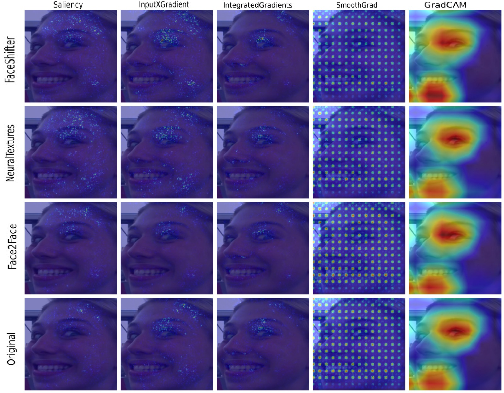
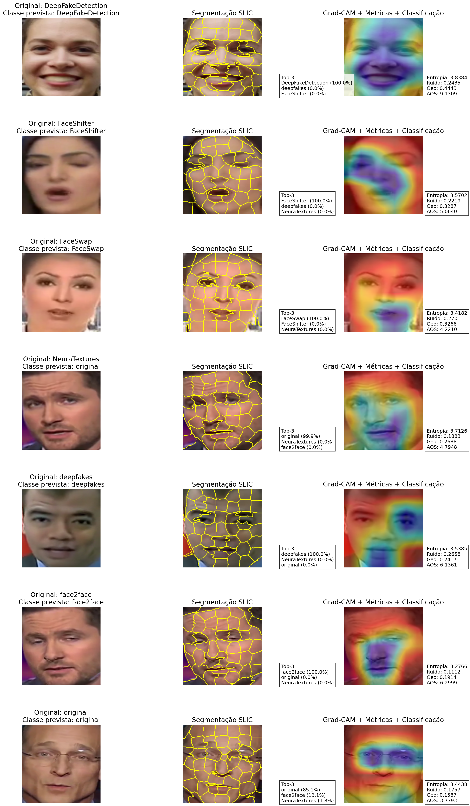

# Artigo-Sibgrapi-2025
Artigo Sibgrapi 2025

## Resumo em Português

Este trabalho apresenta uma análise quantitativa detalhada de métodos de Explainable Artificial Intelligence (XAI) aplicados à detecção multiclasse de Deepfakes com redes neurais convolucionais (CNN). Considerando o aumento da sofisticação das manipulações faciais, o estudo investiga como diferentes técnicas de explicabilidade visual — incluindo Grad-CAM, SLIC, mapas de saliência e abordagens baseadas em segmentação facial — contribuem para interpretar decisões de classificadores de Deepfake. Utilizando um dataset diversificado contendo múltiplas técnicas de manipulação (FaceSwap, FaceShifter, Face2Face, NeuralTextures, DeepFakeDetection e vídeos originais), avaliamos a capacidade dos métodos de XAI em revelar regiões críticas e artefatos característicos de cada classe.

Os resultados demonstram que a explicabilidade visual não apenas auxilia na compreensão das decisões do modelo, mas também expõe limitações e fragilidades associadas a cada técnica de manipulação. Nossas métricas quantitativas — incluindo entropia, robustez geométrica, resposta ao ruído e Active Object Score (AOS) — permitiram comparar objetivamente a qualidade das explicações geradas. A pesquisa evidencia que abordagens baseadas em segmentação facial e Grad-CAM são as que mais preservam coerência espacial e consistência semântica.

Concluímos que a integração de XAI à detecção de Deepfakes fornece um avanço significativo na interpretação dos modelos e na transparência necessária para aplicações críticas, como segurança digital, auditoria de conteúdo e forense computacional. O estudo abre caminho para pipelines explicáveis mais robustos, que combinem classificação, segmentação e análise multirregional de forma integrada.

## Abstract in English

This work presents a detailed quantitative analysis of Explainable Artificial Intelligence (XAI) techniques applied to multiclass DeepFake detection using Convolutional Neural Networks (CNNs). Considering the growing sophistication of facial manipulations, we investigate how different visual explainability methods — including Grad-CAM, SLIC, saliency maps, and facial segmentation–based approaches — contribute to interpreting the decisions made by DeepFake classifiers. Using a diverse dataset encompassing multiple manipulation techniques (FaceSwap, FaceShifter, Face2Face, NeuralTextures, DeepFakeDetection, and original videos), we evaluate the ability of XAI methods to reveal critical regions and manipulation-specific artifacts.

The results show that visual explainability not only supports a deeper understanding of model decisions but also reveals limitations and vulnerabilities associated with each manipulation technique. Our quantitative metrics — including entropy, geometric robustness, noise response, and Active Object Score (AOS) — allowed an objective comparison of explanation quality across methods. We demonstrate that approaches based on facial segmentation and Grad-CAM provide the best spatial coherence and semantic consistency.

We conclude that integrating XAI into DeepFake detection significantly enhances interpretability and transparency, which are essential for applications in digital security, content auditing, and computational forensics. This study paves the way for more robust explainable pipelines that combine classification, segmentation, and multi-region analysis in a unified framework.

Aqui estão detalhes sobre o artigo proposto no sibgrapi 2025
inclusive planilha comparativa de técnicas

